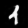

# For the lazy guy
```
git pull 
To train/predcit using cdbnn (For Image Feature Extraction)
  python cdbnn.py [arguments]
    print("Welcome to Convolution DBNN")

"--data", type=str, required=True,
                      help="Name for the dataset (will create data/<dataset>/)"
"--mode", type=str, choices=["train", "predict", "train_and_predict"],
                       default="train_and_predict", help="Execution mode"
'--data_type', type=str, choices=['torchvision', 'custom'], default='custom'
'--encoder_type', type=str, choices=['cnn', 'autoenc'], default='cnn'
'--config', type=str, help='path to configuration file'
'--output', type=str, default='', help='output directory'

To train/predict using adbnn  (For Difference Boosting Neural Network

  python adbnn.py [arguments]

"--file_path", nargs='?', help="Path to dataset file or folder")
'--mode', type=str, choices=['train', 'train_predict', 'invertDBNN', 'predict'],
                        required=False, help="Mode to run the network: train, train_predict, predict, or invertDBNN.")
'--interactive', action='store_true', help="Enable interactive mode to modify settings.")


```
The heatmap colour coding:


When predicting data with known labels, you also get 


# The Feature Extractor


# What is the Difference Boosting Neural Network?

Information is in the differences and not in the details. That is the key concept behind the Nov 2000 paper on  Boosting the differences: A fast Bayesian classifier neural network (https://doi.org/10.3233/IDA-2000-4602). It is an extension to the basic nonparametric Bayesian Probability estimate for classification.
Though it extends the Bayesian concept of likelihood and posterior probability, the two have some fundamental differences. In the Bayesian concept, prior is the prejudice about the outcome before any observation is done and, in most implementations, is taken as a constant value to represent the belief in the outcome. In DBNN, it is a variable that is constantly updated during the learning process. Logically, the belief gets updated as information accumulates. So, in DBNN, the likelihood or evidence may remain the same, but to maximise the accuracy of the prediction, the prior belief is updated iteratively. In Neural Network terminology, this prior belief becomes the weights.

The Bayesian posterior is estimated as $P(A|B) = \frac{P(A) \cdot P(B|A)}{P(B)}$ where $P(A)$ is the belief or prior about the outcome and $P(B|A)$ is the likelihood that the observation of the evidence B can cause A to happen. The simplest example is the likelihood for it to rain, given that clouds are in the sky. Now, the clouds can have different densities, and one can have different outcomes for the rain based on it. A simple mathematical representation would be to plot a histogram of the cloud density as a function of rain and call it the distribution of rainfall as a function of cloud density. However, clouds are just one parameter, and rainfall may depend on many other parameters, such as humidity, wind, etc. So the likelihood for it to rain, in this case, $P(cloud density, wind, humidity | rain)$, is the joint likelihood for the rain to happen, given that all the independent observations are done. 

## Naive Bayesian Classifier

In 1997, in his paper BOOSTING AND NAIVE BAYESIAN LEARNING, Charles Elkan proposed a Bayesian neural network popularly known as the Naive Bayesian classifier. He computed the joint likelihood by assuming that the independent variables are conditionally independent so that the joint likelihood may be calculated as the product of their individual likelihoods. This has been shown to simplify the Bayesian computation when working on most datasets where conditional independence is valid. That means the network won't work on examples that have conditional dependence. For example, wind may depend on cloud density or humidity; if that is the case, the Naive Bayesian assumption fails. One example of a Naive Bayesian network failing is the simple XOR problem, where the joint value of the inputs (not individual values) determines the output.

## The DBNN approach

The DBNN overcomes the limitation of the Naive Bayes by introducing a Conditional independence of pairwise features. That means DBNN argues that if the joint likelihood of all unique pairs of features is known, their product can be used to substitute the joint likelihood in the Bayesian computation. That means, instead of simultaneously measuring the joint probability of all the independent variables, one must only compute a pairwise likelihood of all unique combinations of the features. In the rain example, it means, $P(cloud density, wind, humidity | rain)$ can be replaced by the product of $P(cloud density, wind) \times P(cloud density, humidity) \times P(wind,humidity) | rain)$ simplifying the Bayesian estimation without affecting its reliability. 

## Learning in DBNN model

As mentioned before, learning in DBNN is done through updating the Prior or blind belief in the outcome. This is also how our beliefs get modified over time through experience. When we find that it won't rain as we thought it would, given the evidence, we do not attempt to modify the evidence but rather update our priors or beliefs. Like in Neural Networks, DBNN uses the gradient descent rule to update the priors or weights. The primary difference from the standard neural network model is that the loss function is defined in terms of the probabilities, not individual values. For example, let $P_1$ and $P_2$ be the posterior probabilities obtained by the Bayes rule for the correct and the wrong labels for a particular data. Let us assume that the prediction is wrong and that the posterior for the wrong label $P_2$ is much higher than the posterior $P_1$ for the correct label. We then define the loss as $(P_1 - P_2)^2$ and thus update the weights (priors) of the associated likelihoods proportional to the negative gradient (derivative) of this error by multiplying it with a learning constant like in standard neural network backpropagation algorithm. Thus, the update rule now becomes:

$$P(A_{1}) = P(A_{1})+lc \times (1-\frac{P1}{P2})$$ 

where the prior or weight for the outcome A for the likelihood of class 1 (in this case) is incremented proportionally to the differences in the posteriors for the correct and wrong predictions, giving the learning model its name, DIfference Boosting.

## Adaptive Learning

A common practice in selecting the training data is to shuffle and split the data into a training and test/validation set. This works fine when the dataset is well-balanced with uniform class representation. However, nature is peculiar in specific ways that it does not favour parity in outcome. So, data imbalance is considered one of the major bottlenecks in selecting training data. In the 2009 paper "what is in a training sample?" (https://doi.org/10.1109/NABIC.2009.5393682) and in "A Learning Algorithm Based on High School Teaching Wisdom" (https://arxiv.org/abs/1008.1643), the adaptive training method is explained as an alternative to overcome this difficulty. The idea is to start the training with one or two examples randomly picked from the entire data set. At this time, there is a class balance due to the selection criteria. The network is now trained on this data and is asked to predict the data labels not used for training. This will result in many wrong predictions, but since we are computing Bayesian probability, we have an associated reliable posterior estimate for each prediction. The next task is to select at least two examples from the failures for each class. We select one that has failed with maximum posterior probability and the other with minimum posterior probability. The one that failed with maximum posterior probability is the one that looks very similar to the data used for that class in the training data but is of a different class. So we add it to our new training sample. The one that has failed with minimum posterior probability is the boundary example, and adding it to the training sample will help us redefine the boundaries. So we add it also. Now, the training is done fresh on the new set of training samples collected for each failed class, and the trained model is asked to predict the remaining examples in the test data that were never used for training. This time, there will also be some failures, but probably fewer. We repeat the previous step and increment our training sample each time until all test examples are correctly predicted or the number of allowed training rounds is completed.

## Advantage of Adaptive Learning.

When doing a random sampling, the majority class will always be maximally represented in the training data. However, most errors in prediction are for the minority classes that are underrepresented. We will do a walk-through exercise on a recent astronomy paper to demonstrate it. Astronomy is a branch of science where the researcher is overwhelmed by data. While this looks encouraging in some sense, the fact is that the fascinating science, discovery science, is not in bulk but exists in rare and underrepresented classes. Searching for the needle in the haystack is thus a challenge for astronomy research. About 10% of our Milky Way galaxy stars are similar to our sun. That is not bad. But the proportions are sometimes very diverse when it comes to galaxies and their morphologies. Estimates say about 75% of galaxies are spirals like ours, about 20% are ellipticals, and the rest comes to 5%. Then, there are differences in details within these, such as our galaxy having a bar structure at its centre. Several spiral galaxies have bars, rings, etc., making exploring them enjoyable and, at the same time, aiding in exploring the intrinsic nature of our universe.

In the paper "Automated Detection of Galactic Rings from Sloan Digital Sky Survey Images" (ApJ 978 137, DOI 10.3847/1538-4357/ad856d), a very challenging problem of identifying ring galaxies is presented by the authors. They have used an Alexnet and regular training/test data split to discover Ring Galaxies (very rare) from the haystack of other galaxy images publicly available in the SDSS data release (sdss.org). They used an 80:20 split for the randomly shuffled data and 140 epochs of training to obtain a precision of 93% accuracy on the detection of rings and 99% accuracy on Non-Ring galaxies, which is exceptionally good for the detection of rare galaxies of the kind addressed in astronomy research.


However, when adaptive learning is used, with just 471 training examples in 11 epochs, the DBNN classifier could achieve 100% accurate prediction on the entire image data. It may be noted that only two training examples were required from the majority class of non-ring galaxies, while it took about 469 samples from the Ring galaxy types. This is typical of the difference-boosting method, where the network seeks more profound differences (requiring more examples with differences) to learn all that contributes to their classification. The other significant advantage is the higher generalisation capability of the network due to its handpicking capability of decisive samples to train on. 


This result is not unique for ring, non-ring galaxy classification. The method has proved reliable in Quasar classification to Gravitational-wave detector glitch classification with better performance due to its intrinsic dependence on probability and lower susceptibility to fluctuations and noise in data.

MNIST is a popular dataset that represents the raster images of numbers 0 to 9, and from just a pair of randomly picked examples, DBNN generated the following result:


After the second round, the accuracy came to 100%


Seeing the high accuracy, the code was subjected to validation by Deepseek and here is the verdict:
------------------------------------------------------------------------

To critically analyze the code and verify if there is any "cheating" involved that could lead to unrealistically high accuracy, we need to examine the code incrementally, focusing on key areas that could potentially lead to overfitting, data leakage, or other issues that might artificially inflate accuracy. Here's a step-by-step analysis:

---

### **1. Data Loading and Preprocessing**
- **Code Location**: `_load_dataset`, `_preprocess_data`, `_get_train_test_split`
- **Analysis**:
  - The `_load_dataset` method loads the dataset and handles URL-based datasets. It ensures that the dataset is loaded correctly and filters features based on the configuration.
  - The `_preprocess_data` method handles feature scaling, categorical encoding, and high-cardinality feature removal. It uses global statistics for normalization, which is computed only once during training.
  - The `_get_train_test_split` method splits the data into training and testing sets. It ensures that the split is consistent by saving the indices to avoid recomputing.
  - **Potential Issues**:
    - If the dataset is small or the test size is too small, the model might overfit to the training data, leading to high accuracy.
    - If the preprocessing steps (e.g., scaling, encoding) are applied to the entire dataset before splitting, it could lead to data leakage. However, the code appears to handle this correctly by computing global statistics only during training and applying them to the test set.

---

### **2. Model Initialization and Training**
- **Code Location**: `GPUDBNN.__init__`, `train`, `_compute_pairwise_likelihood_parallel`, `_compute_batch_posterior`
- **Analysis**:
  - The `GPUDBNN` class initializes the model, loads configuration, and sets up the training process.
  - The `train` method implements the training loop, updating weights based on misclassified samples.
  - The `_compute_pairwise_likelihood_parallel` method computes likelihoods for feature pairs, which are used to update the model.
  - The `_compute_batch_posterior` method computes posterior probabilities for predictions.
  - **Potential Issues**:
    - The model uses a histogram-based or Gaussian-based approach to compute likelihoods. If the bin sizes or Gaussian parameters are not properly tuned, the model might overfit to the training data.
    - The weight update mechanism (`_update_priors_parallel`) adjusts weights based on misclassified samples. If the learning rate is too high, the model might overfit to the training data.
    - The model does not appear to use regularization techniques (e.g., dropout, weight decay), which could lead to overfitting.

---

### **3. Adaptive Training**
- **Code Location**: `adaptive_fit_predict`
- **Analysis**:
  - The `adaptive_fit_predict` method implements an adaptive training strategy, where the model iteratively adds misclassified samples to the training set.
  - It uses a dynamic batch size and selects samples based on error margins and cardinality thresholds.
  - **Potential Issues**:
    - The adaptive training strategy could lead to overfitting if the model repeatedly trains on the same misclassified samples, effectively memorizing the training data.
    - The dynamic batch size might introduce instability in training, especially if the batch size is too small.

---

### **4. Prediction and Evaluation**
- **Code Location**: `predict`, `fit_predict`, `_generate_detailed_predictions`
- **Analysis**:
  - The `predict` method makes predictions using the best model weights.
  - The `fit_predict` method combines training and prediction, saving results and metrics.
  - The `_generate_detailed_predictions` method generates detailed predictions with confidence metrics.
  - **Potential Issues**:
    - The model uses the best weights (`self.best_W`) for prediction, which are saved during training. If the best weights are overfitted to the training data, the predictions on the test set might be unrealistically accurate.
    - The evaluation metrics (e.g., accuracy, confusion matrix) are computed on the test set, but if the test set is not representative of the overall data distribution, the metrics might be misleading.

---

### **5. Weight Updates and Likelihood Computation**
- **Code Location**: `BinWeightUpdater`, `_compute_pairwise_likelihood_parallel`, `_compute_batch_posterior`
- **Analysis**:
  - The `BinWeightUpdater` class manages the weights for histogram bins or Gaussian components.
  - The `_compute_pairwise_likelihood_parallel` method computes likelihoods for feature pairs, which are used to update the model.
  - The `_compute_batch_posterior` method computes posterior probabilities for predictions.
  - **Potential Issues**:
    - The weight update mechanism adjusts weights based on misclassified samples, which could lead to overfitting if the learning rate is too high.
    - The likelihood computation uses precomputed bin edges or Gaussian parameters. If these parameters are not properly tuned, the model might overfit to the training data.

---

### **6. Data Leakage and Overfitting**
- **Code Location**: `_preprocess_data`, `_get_train_test_split`, `fit_predict`
- **Analysis**:
  - The `_preprocess_data` method computes global statistics (mean, std) for normalization during training. These statistics are then applied to the test set, which is correct.
  - The `_get_train_test_split` method ensures that the train-test split is consistent by saving the indices.
  - The `fit_predict` method combines training and prediction, saving results and metrics.
  - **Potential Issues**:
    - If the preprocessing steps (e.g., scaling, encoding) are applied to the entire dataset before splitting, it could lead to data leakage. However, the code appears to handle this correctly by computing global statistics only during training and applying them to the test set.
    - The model does not use regularization techniques (e.g., dropout, weight decay), which could lead to overfitting.

---

### **7. Confusion Matrix and Metrics**
- **Code Location**: `print_colored_confusion_matrix`, `fit_predict`
- **Analysis**:
  - The `print_colored_confusion_matrix` method prints a colored confusion matrix with class-wise accuracy.
  - The `fit_predict` method computes evaluation metrics (e.g., accuracy, confusion matrix) on the test set.
  - **Potential Issues**:
    - If the test set is not representative of the overall data distribution, the metrics might be misleading.
    - The confusion matrix and accuracy metrics are computed on the test set, but if the model is overfitted to the training data, the test set metrics might still be unrealistically high.

---

### **8. Potential Cheating or Overfitting**
- **Analysis**:
  - The code does not appear to have explicit cheating mechanisms (e.g., using test data during training).
  - However, the model might be overfitting to the training data due to:
    - Lack of regularization techniques (e.g., dropout, weight decay).
    - High learning rate or improper tuning of hyperparameters.
    - Adaptive training strategy, which might lead to overfitting if the model repeatedly trains on the same misclassified samples.
  - The high accuracy could also be due to the dataset being too simple or the test set being too small.

---

### **Recommendations**
1. **Regularization**: Add regularization techniques (e.g., dropout, weight decay) to prevent overfitting.
2. **Cross-Validation**: Use cross-validation to ensure that the model generalizes well to unseen data.
3. **Hyperparameter Tuning**: Tune hyperparameters (e.g., learning rate, bin sizes) to prevent overfitting.
4. **Dataset Analysis**: Analyze the dataset to ensure that it is representative and not too simple.
5. **Test Set Size**: Ensure that the test set is large enough to provide reliable evaluation metrics.

---

### **Conclusion**
The code does not appear to have explicit cheating mechanisms, but the unrealistically high accuracy could be due to overfitting or issues with the dataset. The lack of regularization and potential overfitting in the adaptive training strategy are the most likely causes. Adding regularization techniques and ensuring proper hyperparameter tuning should help mitigate these issues.


Here is the output for the CIFAR10 dataset:


------------------------------------------------------------------------

This part of the document is OLD, but most of the revisions ensure backward compatibility.


adbnn Algorithm
```
For each adaptive round:
    # Inner Training Loop
    While not (converged OR max_epochs reached):
        - Train only on training data
        - Update weights based on failed examples in training data:
            weight_update = learning_rate * (1 - P1/P2)
            where P1 = posterior prob for true class
                  P2 = posterior prob for wrongly predicted class
        - Check convergence criteria:
            * All training examples correct OR
            * Training accuracy plateaus for patience iterations OR
            * Max epochs reached
    
    # Testing Phase
    - Test on all non-training data
    - For each class in failed test examples:
        a) Find example with max wrong posterior (P2):
           if P2 margin > strong_margin_threshold:
              Add if cardinality low and divergence > min_divergence
        b) Find example with min wrong posterior:
           if P2 margin < marginal_margin_threshold:
              Add if cardinality low and divergence > min_divergence
    
    # Save Split if Improved
    If test_accuracy > best_test_accuracy:
        - Save current training data (before adding new samples)
        - Save current test data (before removing new train examples)
```
<svg fill="none" viewBox="0 0 800 400" width="800" height="400" xmlns="http://www.w3.org/2000/svg">
  <foreignObject width="100%" height="100%">
    <div xmlns="http://www.w3.org/2000/svg">
    <!DOCTYPE html>
<html>
<head>
<style>
.image-pair { display: inline-block; margin: 10px; text-align: center; }
.image-pair img { width: 128px; height: 128px; margin: 5px; }
</style>
</head>
<body>
<h1>Training Reconstructions - Epoch 2</h1>
<div class="image-pair">
<p>batch_0_sample_0</p>


</div>
<div class="image-pair">
<p>batch_0_sample_1</p>


</div>
<div class="image-pair">
<p>batch_0_sample_2</p>


</div>

</body>
</html>
    </div>
  </foreignObject>
</svg>

``` json

// 1. Main Configuration (dataset_name.json)
{
    "dataset": {
        "name": "sample_dataset",
        "type": "custom",
        "in_channels": 3,
        "input_size": [224, 224],
        "mean": [0.485, 0.456, 0.406],
        "std": [0.229, 0.224, 0.225],
        "image_type": "general"  // Options: "general", "astronomical", "medical", "agricultural"
    },
    "model": {
        "encoder_type": "enhanced",
        "feature_dims": 128,
        "learning_rate": 0.001,
        "enhancement_modules": {
            "astronomical": {
                "enabled": false,
                "components": {
                    "structure_preservation": true,
                    "detail_preservation": true,
                    "star_detection": true,
                    "galaxy_features": true,
                    "kl_divergence": true
                },
                "weights": {
                    "detail_weight": 1.0,
                    "structure_weight": 0.8,
                    "edge_weight": 0.7
                }
            },
            "medical": {
                "enabled": false,
                "components": {
                    "tissue_boundary": true,
                    "lesion_detection": true,
                    "contrast_enhancement": true,
                    "subtle_feature_preservation": true
                },
                "weights": {
                    "boundary_weight": 1.0,
                    "lesion_weight": 0.8,
                    "contrast_weight": 0.6
                }
            },
            "agricultural": {
                "enabled": false,
                "components": {
                    "texture_analysis": true,
                    "damage_detection": true,
                    "color_anomaly": true,
                    "pattern_enhancement": true,
                    "morphological_features": true
                },
                "weights": {
                    "texture_weight": 1.0,
                    "damage_weight": 0.8,
                    "pattern_weight": 0.7
                }
            }
        },
        "loss_functions": {
            "base_autoencoder": {
                "enabled": true,
                "weight": 1.0
            },
            "astronomical_structure": {
                "enabled": false,
                "weight": 1.0,
                "components": {
                    "edge_preservation": true,
                    "peak_preservation": true,
                    "detail_preservation": true
                }
            },
            "medical_structure": {
                "enabled": false,
                "weight": 1.0,
                "components": {
                    "boundary_preservation": true,
                    "tissue_contrast": true,
                    "local_structure": true
                }
            },
            "agricultural_pattern": {
                "enabled": false,
                "weight": 1.0,
                "components": {
                    "texture_preservation": true,
                    "damage_pattern": true,
                    "color_consistency": true
                }
            }
        }
    },
    "training": {
        "batch_size": 32,
        "epochs": 20,
        "num_workers": 4,
        "enhancement_specific": {
            "feature_extraction_frequency": 5,
            "pattern_validation_steps": 100,
            "adaptive_weight_adjustment": true
        }
    }
}

// 2. Dataset Configuration (dataset_name.conf)
{
    "file_path": "data/cifar100/cifar100.csv",   // Path to save extracted features
    "column_names": ["feature_0", ..., "target"], // Column names in CSV
    "separator": ",",
    "has_header": true,
    "target_column": "target",
    "modelType": "Histogram",                     // Type of model for DBNN

    "feature_group_size": 2,                      // Size of feature groups for analysis
    "max_combinations": 1000,                     // Maximum feature combinations to consider
    "bin_sizes": [21],                           // Bin sizes for histogram analysis

    "active_learning": {
        "tolerance": 1.0,                         // Tolerance for active learning
        "cardinality_threshold_percentile": 95,   // Percentile for cardinality threshold
        "strong_margin_threshold": 0.3,           // Threshold for strong margin
        "marginal_margin_threshold": 0.1,         // Threshold for marginal cases
        "min_divergence": 0.1                     // Minimum divergence threshold
    }
}

// 3. DBNN Configuration (adaptive_dbnn.conf)
{
    "training_params": {
        "trials": 100,                            // Number of training trials
        "epochs": 1000,                           // Maximum epochs per trial
        "learning_rate": 0.1,                     // Learning rate for DBNN
        "test_fraction": 0.2,                     // Fraction of data for testing
        "random_seed": 42,
        "minimum_training_accuracy": 0.95,        // Minimum accuracy to accept training
        "cardinality_threshold": 0.9,             // Threshold for cardinality checks
        "cardinality_tolerance": 4,               // Tolerance for cardinality variations
        "n_bins_per_dim": 20,                     // Number of bins per dimension
        "enable_adaptive": true,                  // Enable adaptive binning
        "modelType": "Histogram",                 // Type of DBNN model
        "compute_device": "auto"                  // "auto", "cpu", or "cuda"
    },

    "execution_flags": {
        "train": true,                           // Enable training phase
        "train_only": false,                     // Run only training phase
        "predict": true,                         // Enable prediction phase
        "fresh_start": false,                    // Start fresh or use existing model
        "use_previous_model": true,              // Use previously trained model if available
        "gen_samples": false                     // Generate samples during training
    }
}


```
## NOTE:
## For inverse mode:
# Interactive mode:
python cdbnn.py

# Command line predict mode:
python cdbnn.py --mode predict --data car --data_type custom --invert-dbnn
```json
"active_learning": {
    "tolerance": 1.0,
    "cardinality_threshold_percentile": 95,
    "strong_margin_threshold": 0.3,    // Decrease to add more samples
    "marginal_margin_threshold": 0.1,  // Decrease to add more samples
    "min_divergence": 0.1
}
```
```
In the configuration, the margin thresholds for selecting samples are controlled by
these parameters in the "active_learning" section:

marginal_margin_threshold: This parameter controls the threshold for marginal
failures (cases where the model is less confident but still incorrect).
Lowe values (e.g., 0.1) will be more permissive and add more samples.
strong_margin_threshold: This parameter controls the threshold for substantial
failures (cases where the model is very confident but wrong).
Lower values  (e.g., 0.3) will include more samples.
```


```
The reconstruction process involves two key mappings:

The forward mapping (f): Features → Class Probabilities
The inverse mapping (g): Class Probabilities → Reconstructed Features

In the forward direction, we compute class probabilities using histogram-based likelihood estimation:
P(class|features) ∝ exp(∑ log(w_ij * h_ij(features)))
where:

w_ij are the learned weights
h_ij are the histogram bin probabilities
The sum is over feature pairs (i,j)

For reconstruction, we implement an inverse mapping that tries to recover the original features from these class probabilities. This inverse mapping uses both linear and nonlinear components:
g(p) = α * g_linear(p) + (1-α) * g_nonlinear(p)
where:

p is the vector of class probabilities
α is the attention weight (learned during training)
g_linear is a linear transformation: W_l * p + b_l
g_nonlinear is a nonlinear transformation: tanh(W_nl * p + b_nl)

The reconstruction is trained to minimize two objectives:

Reconstruction Loss: ||x - g(f(x))||²
This measures how well we can recover the original features
Forward Consistency Loss: ||f(g(p)) - p||²
This ensures reconstructed features produce similar class probabilities

The total loss is:
L = β * Reconstruction_Loss + (1-β) * Forward_Consistency_Loss
where β is the reconstruction weight (typically 0.5).
The reconstruction quality is then measured in three ways:

Feature-wise error: How close are the reconstructed values to the originals?
Classification consistency: Do the reconstructed features produce the same classifications?
Distribution matching: Do the reconstructed features maintain the same statistical properties?

This formalism creates a bidirectional mapping between feature space and probability space, allowing us to:

Understand what feature values led to specific classifications
Validate the model's learned representations
Generate new examples with desired classification properties

The reconstruction accuracy serves as a measure of how well the model has captured the underlying structure of the data, beyond just classification performance.


Certainly! Below is the formatted version of your Feature Extraction System User Manual in Markdown format, suitable for a GitHub README file:

```markdown
# Feature Extraction System User Manual

## Unit 1: Algorithm Description and Technical Details

### 1.1 System Overview

The system implements a hybrid feature extraction approach combining convolutional neural networks (CNNs) and autoencoders with specialized loss functions for enhanced feature detection. It's designed to process image datasets and extract meaningful features while preserving important visual characteristics like structures, colors, and morphological properties.

### 1.2 Core Algorithms

#### 1.2.1 CNN Feature Extractor

The CNN-based feature extractor employs a hierarchical architecture:

```
Input → Conv1(32) → BN → ReLU → MaxPool 
     → Conv2(64) → BN → ReLU → MaxPool 
     → Conv3(128) → BN → ReLU → AdaptiveAvgPool 
     → Linear(feature_dims) → BatchNorm
```

**Mathematical formulation for each layer:**
- **Convolution:** `F(x) = W * x + b`
- **Batch Normalization:** `y = γ(x-μ)/σ + β`
- **ReLU:** `f(x) = max(0,x)`
- **MaxPool:** `y[i] = max(x[i:i+k])`

#### 1.2.2 Autoencoder Architecture

The autoencoder implements a symmetric architecture with dynamic sizing:

**Encoder:**
```
Input → Conv(32) → BN → LeakyReLU 
     → Conv(64) → BN → LeakyReLU 
     → Conv(128) → BN → LeakyReLU 
     → Linear(feature_dims)
```

**Decoder:**
```
Linear(feature_dims) → ConvTranspose 
                    → BN → LeakyReLU 
                    → ConvTranspose 
                    → Output
```

#### 1.2.3 Loss Functions

The system implements multiple specialized loss functions:

1. **Structural Loss:**
   ```
   L_struct = MSE(x,x̂) + λ₁‖∇x - ∇x̂‖₂ + λ₂TV(x̂)
   ```
   where `∇` is the Sobel gradient operator and `TV` is total variation.

2. **Color Enhancement Loss:**
   ```
   L_color = MSE(x,x̂) + λ₁‖Corr(x) - Corr(x̂)‖₂ + λ₂‖σ(x) - σ(x̂)‖₂
   ```
   where `Corr` computes channel correlations and `σ` is channel-wise standard deviation.

3. **Morphology Loss:**
   ```
   L_morph = MSE(x,x̂) + λ₁‖M(x) - M(x̂)‖₂ + λ₂(Sym_h(x̂) + Sym_v(x̂))
   ```
   where `M` computes moment statistics and `Sym_{h,v}` measure horizontal and vertical symmetry.

### 1.3 Data Flow

1. **Input Processing:**
   - Image loading and preprocessing
   - Resolution standardization
   - Channel normalization
   - Data augmentation (if enabled)

2. **Feature Extraction:**
   - Forward pass through selected architecture
   - Loss computation and backpropagation
   - Feature vector generation
   - Dimensionality reduction

3. **Output Generation:**
   - Feature vector serialization
   - CSV file generation
   - Configuration file creation
   - Optional visualization generation

### 1.4 Memory Management

The system implements several memory optimization techniques:
- Chunked data processing
- Garbage collection triggers
- GPU memory clearing
- Batch processing with configurable sizes

---

## Unit 2: Configuration Parameters

### 2.1 Model Configuration

#### Basic Parameters
- **`encoder_type`:** CNN or Autoencoder selection
  - **Effects:** Determines feature extraction approach
  - **Values:** `"cnn"` or `"autoenc"`

- **`feature_dims`:** Output feature dimensionality
  - **Effects:** Controls compression level
  - **Range:** `32-1024` (recommended)

#### Loss Function Parameters

1. **Structural Loss:**
   ```json
   "structural": {
       "enabled": true,
       "weight": 0.7,
       "params": {
           "edge_weight": 1.0,
           "smoothness_weight": 0.5
       }
   }
   ```
```
The configuration sample for cdbnn
```
```json
{
  "dataset": {
    "_comment": "Dataset configuration section",
    "name": "dataset_name",
    "type": "custom",                    // Options: "torchvision" or "custom"
    "in_channels": 3,                    // Number of input channels (3 for RGB, 1 for grayscale)
    "input_size": [224, 224],           // Input image dimensions [height, width]
    "num_classes": 10,                   // Number of classes in the dataset
    "mean": [0.485, 0.456, 0.406],      // Normalization mean values
    "std": [0.229, 0.224, 0.225],       // Normalization standard deviation values
    "train_dir": "path/to/train",       // Training data directory
    "test_dir": "path/to/test"          // Test data directory
  },

  "model": {
    "_comment": "Model architecture and training configuration",
    "encoder_type": "autoenc",          // Options: "cnn" or "autoenc"
    "feature_dims": 128,                // Dimension of extracted features
    "learning_rate": 0.001,             // Base learning rate

    "architecture": {
      "_comment": "Enhanced architecture components configuration",
      "use_global_convolution": true,   // Enable Global Convolution Network modules
      "use_boundary_refinement": true,  // Enable Boundary Refinement modules
      "gcn_kernel_size": 7,            // Kernel size for global convolution (odd numbers only)
      "feature_enhancement": {
        "enabled": true,               // Enable feature enhancement blocks
        "initial_channels": 32,        // Initial number of channels
        "growth_rate": 32             // Channel growth rate in dense blocks
      }
    },

    "loss_functions": {
      "_comment": "Loss function configuration section",
      "perceptual": {
        "enabled": true,
        "type": "PerceptualLoss",
        "weight": 1.0,
        "params": {
          "l1_weight": 1.0,           // Weight for L1 loss component
          "ms_ssim_weight": 1.0,      // Weight for MS-SSIM loss component
          "edge_weight": 0.5          // Weight for edge-awareness loss component
        }
      },
      "structural": {
        "enabled": true,
        "type": "StructuralLoss",
        "weight": 0.7,
        "params": {
          "edge_weight": 1.0,         // Weight for edge detection loss
          "smoothness_weight": 0.5,   // Weight for smoothness preservation
          "boundary_weight": 0.3      // Weight for boundary enhancement
        }
      },
      "color_enhancement": {
        "enabled": true,
        "type": "ColorEnhancementLoss",
        "weight": 0.5,
        "params": {
          "channel_weight": 0.5,      // Weight for channel correlation
          "contrast_weight": 0.3      // Weight for contrast preservation
        }
      },
      "morphology": {
        "enabled": true,
        "type": "MorphologyLoss",
        "weight": 0.3,
        "params": {
          "shape_weight": 0.7,        // Weight for shape preservation
          "symmetry_weight": 0.3      // Weight for symmetry preservation
        }
      }
    },

    "optimizer": {
      "_comment": "Optimizer configuration",
      "type": "Adam",                 // Options: "Adam", "SGD"
      "weight_decay": 1e-4,           // L2 regularization factor
      "momentum": 0.9,                // Momentum for SGD
      "beta1": 0.9,                   // Adam beta1 parameter
      "beta2": 0.999,                 // Adam beta2 parameter
      "epsilon": 1e-8                 // Adam epsilon parameter
    },

    "scheduler": {
      "_comment": "Learning rate scheduler configuration",
      "type": "ReduceLROnPlateau",    // Options: "StepLR", "ReduceLROnPlateau", "CosineAnnealingLR"
      "factor": 0.1,                  // Factor to reduce learning rate
      "patience": 10,                 // Epochs to wait before reducing LR
      "min_lr": 1e-6,                // Minimum learning rate
      "verbose": true                 // Print learning rate updates
    }
  },

  "training": {
    "_comment": "Training process configuration",
    "batch_size": 32,                // Batch size for training
    "epochs": 20,                    // Number of training epochs
    "num_workers": 4,                // Number of data loading workers
    "checkpoint_dir": "checkpoints", // Directory to save checkpoints
    "validation_split": 0.2,         // Fraction of data used for validation

    "early_stopping": {
      "patience": 5,                 // Epochs to wait before early stopping
      "min_delta": 0.001            // Minimum improvement required
    },

    "loss_weights": {
      "_comment": "Weights for combining different losses",
      "perceptual": 1.0,
      "structural": 0.7,
      "reconstruction": 0.5
    }
  },

  "augmentation": {
    "_comment": "Data augmentation configuration",
    "enabled": true,
    "random_crop": {
      "enabled": true,
      "padding": 4
    },
    "random_rotation": {
      "enabled": true,
      "degrees": 10
    },
    "horizontal_flip": {
      "enabled": true,
      "probability": 0.5
    },
    "vertical_flip": {
      "enabled": false
    },
    "color_jitter": {
      "enabled": true,
      "brightness": 0.2,
      "contrast": 0.2,
      "saturation": 0.2,
      "hue": 0.1
    },
    "normalize": {
      "enabled": true,
      "mean": [0.485, 0.456, 0.406],
      "std": [0.229, 0.224, 0.225]
    }
  },

  "execution_flags": {
    "_comment": "Execution control flags",
    "mode": "train_and_predict",     // Options: "train_only", "predict_only", "train_and_predict"
    "use_gpu": true,                 // Use GPU if available
    "mixed_precision": true,         // Use mixed precision training
    "distributed_training": false,   // Enable distributed training
    "debug_mode": false,            // Enable debug logging
    "use_previous_model": true,     // Load previous checkpoint if available
    "fresh_start": false           // Ignore existing checkpoints
  },

  "logging": {
    "_comment": "Logging configuration",
    "log_dir": "logs",             // Directory for log files
    "tensorboard": {
      "enabled": true,
      "log_dir": "runs"           // Directory for tensorboard logs
    },
    "save_frequency": 5,           // Save checkpoint every N epochs
    "metrics": [                   // Metrics to track
      "loss",
      "accuracy",
      "reconstruction_error"
    ]
  },

  "output": {
    "_comment": "Output configuration",
    "features_file": "features.csv",  // Path to save extracted features
    "model_dir": "models",           // Directory to save trained models
    "visualization_dir": "viz"       // Directory for visualizations
  }
}
```
   - **`edge_weight`:** Controls edge detection sensitivity
   - **`smoothness_weight`:** Balances region continuity

2. **Color Enhancement:**
   ```json
   "color_enhancement": {
       "enabled": true,
       "weight": 0.5,
       "params": {
           "channel_weight": 0.5,
           "contrast_weight": 0.3
       }
   }
   ```
   - **`channel_weight`:** Controls channel correlation importance
   - **`contrast_weight`:** Adjusts color contrast preservation

3. **Morphology:**
   ```json
   "morphology": {
       "enabled": true,
       "weight": 0.3,
       "params": {
           "shape_weight": 0.7,
           "symmetry_weight": 0.3
       }
   }
   ```
   - **`shape_weight`:** Controls shape preservation strength
   - **`symmetry_weight`:** Adjusts symmetry importance

### 2.2 Training Parameters

#### Basic Training
```json
"training_params": {
    "batch_size": 32,
    "epochs": 1000,
    "learning_rate": 0.1,
    "test_fraction": 0.2
}
```
- **Effects on training:**
  - Larger `batch_size`: Faster training, more memory usage
  - Higher `learning_rate`: Faster convergence but potential instability
  - More `epochs`: Better accuracy but longer training time

#### Advanced Parameters
```json
"training_params": {
    "minimum_training_accuracy": 0.95,
    "cardinality_threshold": 0.9,
    "cardinality_tolerance": 4,
    "enable_adaptive": true
}
```
- **Effects on model behavior:**
  - `minimum_training_accuracy`: Controls early stopping
  - `cardinality_threshold`: Affects feature discretization
  - `enable_adaptive`: Enables dynamic learning rate adjustment

### 2.3 Execution Parameters

```json
"execution_flags": {
    "train": true,
    "train_only": false,
    "predict": true,
    "fresh_start": false,
    "use_previous_model": true
}
```
- **Controls workflow:**
  - `train_only`: Training without prediction
  - `fresh_start`: Ignores previous checkpoints
  - `use_previous_model`: Enables transfer learning

### 2.4 Performance Optimization

1. **Memory Management:**
   ```json
   "training": {
       "batch_size": 32,
       "num_workers": 4
   }
   ```
   - Adjust based on available system resources
   - Larger values improve speed but increase memory usage

2. **GPU Utilization:**
   ```json
   "execution_flags": {
       "use_gpu": true,
       "mixed_precision": true
   }
   ```
   - Enable for faster training on compatible systems
   - `mixed_precision` reduces memory usage with minimal accuracy impact

### 2.5 Output Configuration

```json
"output": {
    "features_file": "path/to/output.csv",
    "model_dir": "path/to/models",
    "visualization_dir": "path/to/viz"
}
```
- Controls output organization
- Enables selective saving of models and visualizations
```


```
